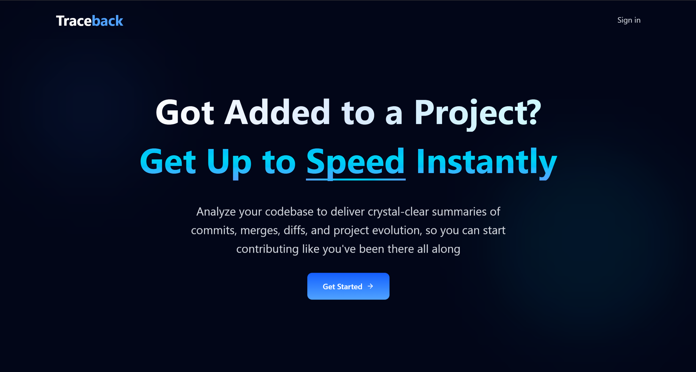

# 🧭 Traceback

Traceback helps developers get up to speed with new projects instantly.  
By summarizing **Git commits, merges, and diffs** using **Gemini AI**, it
provides a clear overview of what’s been happening in a repository — so you can
focus on contributing instead of catching up.

<!--  -->

---

## ✨ Features

- 🧠 **AI-Powered Summaries** – Automatically summarizes commit history, merge
  activity, and diffs using Gemini AI.
- 📊 **Project Dashboard** – View organized summaries, recent commits, and key
  repository insights in one place.
- ⚡ **Next.js + React** – Modern app router, server actions, and client-side
  interactivity.
- 🌓 **Aesthetic UI** – Sleek, accessible design built with Tailwind CSS.

---

## 🏗️ Tech Stack

**Frontend:** Next.js, React, Tailwind CSS  
**Backend / API:** Next.js API Routes  
**AI Integration:** Gemini AI API

---

## 🚀 Getting Started

### 1️⃣ Clone the Repository

```bash
git clone https://github.com/louisnguyenn/Traceback.git
cd Traceback
```

### 2️⃣ Install Dependencies

```bash
npm install
```

### 3️⃣ Set Up Environment Variables

Create a .env.local file in the project root and add:

```bash
GEMINI_API_KEY=your_api_key_here
```

### 4️⃣ Run the Development Server

```bash
npm run dev
```

Then open http://localhost:3000 in your browser

## 🧭 Credits

Created by Louis Nguyen
